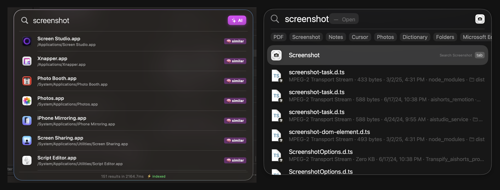

<p align="center">
  
</p>

<h1 align="center">BetterSearch</h1>

<p align="center">
  <strong>A lightning-fast Spotlight replacement that actually finds your files.</strong>
</p>

<p align="center">
  <a href="https://github.com/furqan4545/BetterSearch/releases/latest">
    
  </a>
  
  
  
</p>

---

## The Problem

macOS Spotlight is broken. Search for "screenshot" and it gives you random `.d.ts` files from `node_modules` instead of the actual screenshot apps on your machine. Search for a file you KNOW exists and it takes forever — or just doesn't find it.

**BetterSearch fixes this.**

## BetterSearch vs Spotlight

<p align="center">
  
</p>

> Search "screenshot" — BetterSearch finds **Screen Studio, Xnapper, Photo Booth, Photos** and other relevant apps. Spotlight returns `screenshot-task.d.ts` from node_modules. Enough said.

---

## Features

### 5-Layer AI Search Engine

BetterSearch doesn't just match filenames. It runs **5 search layers in parallel**, streaming results as they're found:

| Layer | What it does | Speed |
|-------|-------------|-------|
| **Exact Match** | In-memory filename index across your entire system | < 1ms |
| **App Metadata** | Finds apps by what they DO, not just their name (searches bundle IDs, descriptions) | ~50ms |
| **Fuzzy Match** | Catches typos — "safri" still finds Safari | ~5ms |
| **Semantic Search** | Uses Apple's NLEmbedding to find related words — "capture" finds "screenshot" | ~10ms |
| **Category Detection** | Type "photos" to see all images, "videos" for all videos, "music" for all audio | instant |
| **Content Search** | Searches INSIDE files — find a PDF by the text it contains | ~200ms |

### Smart Ranking

Results are ranked by what matters to YOU, not by filesystem order:

1. **Apps** — always on top
2. **Documents** — PDF, Word, Excel, PowerPoint
3. **Images** — PNG, JPG, HEIC, screenshots
4. **Videos** — MP4, MOV, screen recordings
5. **Music** — MP3, WAV, FLAC
6. **Folders** — directory matches
7. **Code files** — only if nothing better matches

System junk, cache files, and `node_modules` are filtered out.

### Real Thumbnails

Not just generic file icons — BetterSearch shows actual previews for images, videos, PDFs, and documents using macOS QuickLook.

### Copy & Clipboard

- **Click** any file to open it
- **Right-click** → Copy Path for use in terminal or file pickers
- **Click the copy icon** on images to copy to clipboard — select multiple images and they all get copied at once
- **Drag & drop** files directly from search results into any file picker

### Beautiful Glass UI

Translucent vibrancy effect with animated gradient border, liquid glass open/close animation, and native macOS feel. Looks stunning on both light and dark backgrounds.

---

## Install

1. **Download** `BetterSearch-v1.0.dmg` from [Releases](https://github.com/furqan4545/BetterSearch/releases/latest)
2. Open the DMG and drag **BetterSearch** to your Applications folder
3. Launch BetterSearch
4. Grant **Accessibility permission** when prompted (required for global hotkey)
5. Done — press **Cmd + Shift + Space** from anywhere

### First Launch

On first launch, BetterSearch indexes your files in the background. This takes about 10-15 seconds depending on how many files you have. After that, searches are instant (sub-millisecond).

---

## Usage

| Action | How |
|--------|-----|
| Open search | `Cmd + Shift + Space` |
| Open a file | Click on it or press `Enter` |
| Show in Finder | Right-click → Show in Finder |
| Copy file path | Right-click → Copy Path |
| Copy image | Click the copy icon (works with multiple selections) |
| Close search | `Escape` or click outside |
| Toggle AI search | Click the **AI** label to enable/disable smart layers |
| Navigate results | `↑` `↓` arrow keys |

---

## How It Works

BetterSearch builds an in-memory index of your filesystem on launch by scanning:

- `~/Desktop`
- `~/Downloads`
- `~/Documents`
- `~/Music`, `~/Movies`, `~/Pictures`
- `/Applications` (including system apps)

The index lives in RAM — no database, no disk writes. When you type, it filters this index in under 1 millisecond. The AI layers (fuzzy, semantic, category, content) run in parallel on background threads and stream results into the UI as they're found.

The app uses **zero CPU when idle**. No background processes, no daemons, no analytics.

---

## Requirements

- macOS 12.4 (Monterey) or later
- Accessibility permission (for global hotkey)
- ~50MB RAM while indexing, ~15MB idle

---

## System Impact

| Resource | Usage |
|----------|-------|
| Disk | 1.9 MB (DMG) |
| RAM (idle) | ~15 MB |
| RAM (indexing) | ~50 MB |
| CPU (idle) | 0% |
| Background processes | None |
| Dock icon | Hidden (menu bar only) |

---

## Tech Stack

- **Swift + SwiftUI + AppKit** — native macOS, no Electron
- **NSMetadataQuery** — Spotlight API for content search
- **NLEmbedding** — Apple's built-in word embeddings for semantic search
- **QLThumbnailGenerator** — native thumbnails for previews
- **Carbon RegisterEventHotKey** — bulletproof global hotkey

---

## Build from Source

```bash
git clone https://github.com/furqan4545/BetterSearch.git
cd BetterSearch
open BS.xcodeproj
```

Select **BS** scheme → **My Mac** → Build & Run (`Cmd + R`)

---

## Contact

Have feedback, bugs, or feature requests?

**Email:** ali@screenshow.app

---

<p align="center">
  Built with frustration towards macOS Spotlight and a lot of caffeine.
</p>
